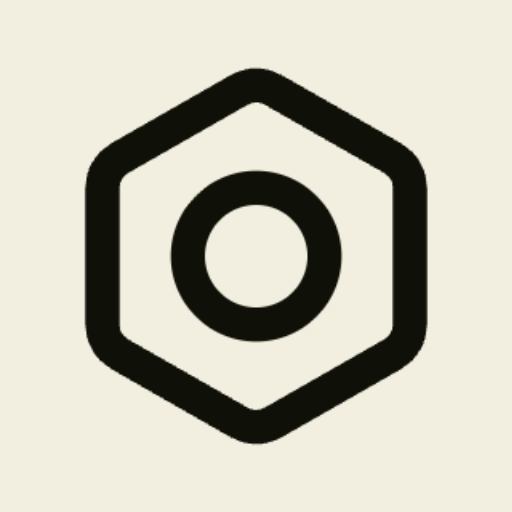

# MonoBrowser



Minimal browser built with **PyQt6** + **QtWebEngine**.

## Development

```bash
uv run -m monobrowser.main
```
# Tests

```bash
uv run ruff check . && uv run ruff format --check . && uv run mypy src tests && uv run pytest -q
```
## Build (standalone .app)

```bash
./build.sh
```

Output: `dist/MonoBrowser.app`

```bash
open dist/MonoBrowser.app
```
